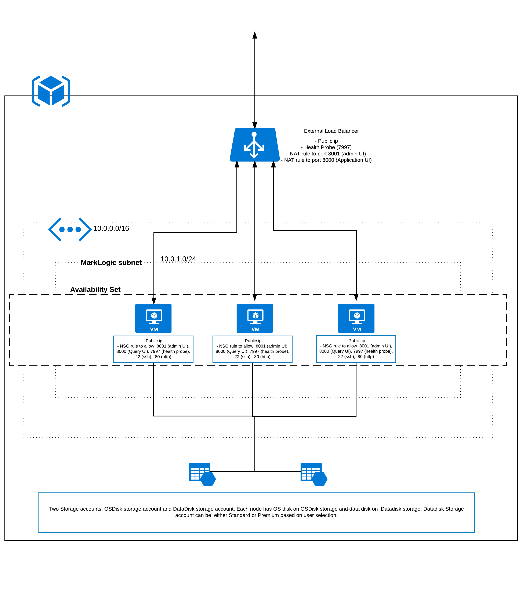
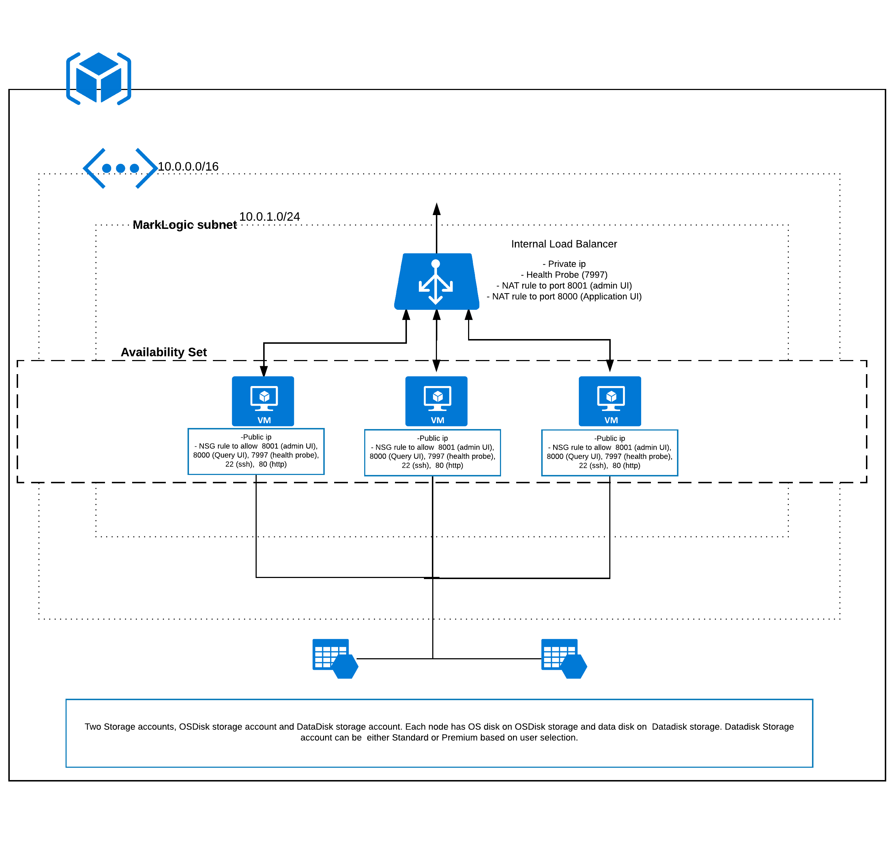
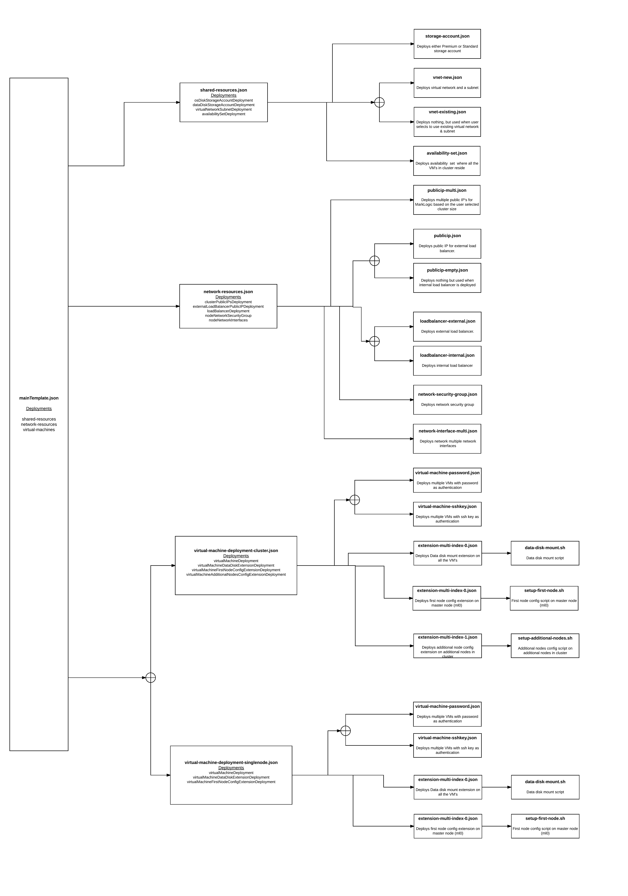

# MarkLogic

##Deployment Architecture

**High level architecture diagram for MarkLogic deployment (with 3 nodes) with external load balancer**

 
 
 **High level architecture diagram for MarkLogic deployment (with 3 nodes) with internal load balancer**
 
 

**MarkLogic 3 node cluster with external/Internal load balancer** looks as shown in the above images. Template deployment deploys a virtual network and a subnet or user can use existing virtual network or subnet. Also, an availability set is deployed where all the cluster nodes reside.

Two storage accounts are deployed, one to store cluster nodes OS disks and other to store cluster nodes data disk (premium or standard storage account).

Public IP and Network interfaces are created for all the nodes. Network Security group is created and attached to VMs. Network security group allows port 22, 80, 7997, 8000, 8001 as part of deployment.

External load balancer or Internal load balancer is deployed based on the user selection, external load balancer has public IP and internal load balancer has private IP and it takes a private IP associated with the subnet. Private IP for internal load balancer is taken as input from user.

Both External and Internal load balancers have same load balancing rules, health probe at port 7997, NAT rule for port 8001 (admin UI) with frontend ports 2200, 2201… for node1, node2…  respectively.  Similarly, NAT rule for port 8000 (query UI) with frontend ports 3300, 3301… for node1, node2…  respectively. As part of deployment there is no load balancing rule, user must configure once the deployment is done based on user preference.

Virtual machine with MarkLogic 8 image is created and extensions such as data disk mount extension (to mount data disk), first node configuration (to configure first node), additional nodes configuration (to configure additional nodes) are executed as part of deployment.

##Template Architecture

 

Template deployment starts with mainTemplate.json, which has all the parameters for user input and variables that are constructed to use in the subsequent nested templates. mainTemplate.json has three deployments in the resources section (All the objects referred are from main templates variables section):

1. **Shared Resources (shared-resources):** Deploys shared resources such as Storage accounts, Availability set, Virtual Network and Subnet. &#39;shared-resources.json&#39; is deployed and which has deployment (resources) sections:

  * **OS Disk Storage Account (osDiskStorageAccountDeployment):** Deploys standard storage account resource for MarkLogic VM&#39;s OS disks through &quot;storage-account.json&quot;. Input to &quot;stoarge-account.json&quot; is &quot;osDiskStoarge&quot; object under &quot;storageSettings&quot; object.

  * **Data Disk Storage Account (dataDiskStorageAccountDeployment):** Deploys either premium or standard (based on user selection) storage account resource for MarkLogic VM&#39;s data disks through &quot;storage-account.json&quot;. Input to &quot;stoarge-account.json&quot; is &quot;dataDiskStoarge&quot; object under &quot;storageSettings&quot; object.

  * **Virtual Network and Subnet (virtualNetworkSubnetDeployment):**        Deploys either a new virtual network &amp; subnet (one subnet) or use an existing one in that resource group (based on user selection). To create new &quot;vnet-new.json&quot; and to use existing &quot;vnet-existing.json&quot; are deployed. Input to &quot;vnet-new.json&quot; and &quot;vnet-existing.json&quot; is &quot;networkSettings&quot; object.

  * **Availability Set (availabilitySetDeployment):** Deploys availability set where all the MarkLogic cluster VM&#39;s reside. &quot;availability-set.json&quot; is used to create availability set. By default, availability set deploys with fault domain as &quot;3&quot; update domain as &quot;20&quot;. Input to &quot;availability-set.json&quot; is &quot;networkSettings&quot; object.

2. **Network Resources (network-resources):** Deploys network resources such as public IP&#39;s, external or internal load balancer, network security group and network interfaces.

  * **Public IP&#39;s (clusterPublicIPsDeployment):** Deploys public IPs for each node in the cluster. &quot;publicip-multi.json&quot; file is used to create public IPs. Input to &quot;publicip-multi.json&quot; is &quot;nodeNetworkSettings&quot; object under &quot;networkSettings&quot; object.

  * **External Load Balancer Public IP (externalLoadBalancerPublicIPDeployment):** Deploys public IP for external load balancer. Based on the user selection it will identify the template Uri and deploys the public IPs. If the user selects &quot;external&quot; load balancer &quot;publicip.json&quot; template is deployed. If the user selects &quot;internal&quot; load balancer &quot;publicip-empty.json&quot; template is deployed. Input to &quot;publicip.json&quot; and &quot;publicip-empty.json&quot; is &quot;loadBalancerNetworkSettings&quot; object under &quot;networkSettings&quot; object.

  * **Load Balancer (loadBalancerDeployment): **Deploy the load balancer for the cluster, based on the user selection template deploys either &quot;internal&quot; or &quot;external&quot; load balancer. If the user selects &quot;internal&quot; or &quot;external&quot; load balancer templates &quot;loadbalancer-internal.json&quot; or &quot;loadbalancer-external.json&quot; will get deployed respectively. External load balancer has public IP and internal load balancer has static private IP address based on the user input with respective to the subnet the load balancer is present. As part of deployment there will not be any load balancing rule, which user can configure after the deployment. But the health probe is configured at port 7997. NAT rules for Admin UI at 8001 and Query UI port 8000 are configured as part of deployment. User can access the admin UI on node one through load balancer using http://loadbalancer-IP:2200 and for node two it is http://loadbalancer-IP:2201 and so on. Similarly, to access Query UI it is http://loadbalancer-IP:3300 on first node,http://loadbalancer-IP:3301 on node two etc. Input to &quot;loadbalancer-internal.json&quot; and &quot;loadbalancer-external.json&quot; is &quot;loadBalancerNetworkSettings&quot; object under &quot;networkSettings&quot; object.

  * **Network Security Group (nodeNetworkSecurityGroup):** Deploy the network security group (NSG) for the cluster. In enables &quot;ssh&quot; at port number 22, &quot;http&quot; at port number 80, &quot;admin&quot; console port number at 8001, &quot;health-check&quot; port number at 7997, &quot;query&quot; console port number at 8000 and &quot;manage&quot; console port number at 8002. It uses &quot;network-security-group.json&quot; template for deploying NSG. Input to &quot;network-security-group.json&quot; is &quot;nodeNetworkSettings&quot; object under &quot;networkSettings&quot; object.

  * **Network Interface (nodeNetworkInterfaces):** Deploy the network Interfaces (NICs) for all the nodes in the cluster. &quot;network-interface-multi.json&quot; template is used to deploy NICs for all the nodes. Input to &quot;network-security-group.json&quot; is &quot;nodeNetworkSettings&quot; object under &quot;networkSettings&quot; object.

3. **Virtual Machines (virtual-machines):** Deploys virtual machines and virtual machine extensions. Virtual Machines deployment consists of two types based on the user selection &quot;Single node&quot; deployment and &quot;Cluster/ Multi node&quot; deployment.

  * **Single node:** Deploys single node when user selects node count as &#39;1&#39;. &quot;virtual-machine-deployment-singlenode.json&quot; template is used for the deployment.It consists of following deployments:

      * **Virtual Machine (virtualMachineDeployment):** Deploys virtual machine based on authentication type. If user selects the authentication type as &quot;password&quot; or &quot;sshkey&quot; then templates &quot;virtual-machine-password.json&quot; or &quot;virtual-machine-sshkey.json&quot; is deployed respectively. Either template deploys virtual machine(s) with &quot;MarkLogic 8&quot; SKU and 1GB datadisk. Input object is &quot;virtualMachineSettings&quot;.

      * **Data Disk Mount Extension (virtualMachineDataDiskExtensionDeployment):** Deploys Linux custom script extension using &quot;extension-multi-index-0.json&quot; template which will partition the attached data disk and make it available for writing the data into it. This extension uses shell script named &quot; [data-disk-mount.sh](https://github.com/sysgain/MarkLogic/blob/mldevchange/scripts/data-disk-mount.sh)&quot;. This extension runs on all the nodes in the cluster. Input to &quot;extension-multi-index-0.json&quot; is &quot;dataDiskExtension&quot; object under &quot;virtualMachineSettings&quot; object.

      * **First Node Configuration Extension (virtualMachineFirstNodeConfigExtensionDeployment):** Deploys Linux custom script extension using &quot;extension-multi-index-0.json&quot; template which will setup the first node in the cluster. The extension uses &quot; [setup-first-node.sh](https://github.com/sysgain/MarkLogic/blob/mldevchange/scripts/setup-first-node.sh)&quot; shell script. This extension runs on only master node (first node – ml0). Input to &quot;extension-multi-index-0.json&quot; is &quot;firstNodeConfigExtension&quot; object under &quot;virtualMachineSettings&quot; object.

  * **Cluster / Multi node:** Deploys cluster/ multi nodes when user selects node count as 3, 4, 5, 7, 9. &quot;virtual-machine-deployment-cluster.json &quot; template is used for this deployment. It consists of the following deployments:

      * **Virtual Machine (virtualMachineDeployment):** Deploys virtual machine based on authentication type. If user selects the authentication type as &quot;password&quot; or &quot;sshkey&quot; then templates &quot;virtual-machine-password.json&quot; or &quot;virtual-machine-sshkey.json&quot; is deployed respectively. Either template deploys virtual machine(s) with &quot;MarkLogic 8&quot; SKU and 1GB datadisk. Input object is &quot;virtualMachineSettings&quot;.

      * **Data Disk Mount Extension (virtualMachineDataDiskExtensionDeployment):** Deploys virtual machine based on authentication type. If user selects the authentication type as &quot;password&quot; or &quot;sshkey&quot; then templates &quot;virtual-machine-password.json&quot; or &quot;virtual-machine-sshkey.json&quot; is deployed respectively. Either template deploys virtual machine(s) with &quot;MarkLogic 8&quot; SKU and 1GB datadisk. Input object is &quot;virtualMachineSettings&quot;.

      * **First Node Configuration Extension (virtualMachineFirstNodeConfigExtensionDeployment):** Deploys Linux custom script extension using &quot;extension-multi-index-0.json&quot; template which will setup the first node in the cluster. The extension uses &quot; [setup-first-node.sh](https://github.com/sysgain/MarkLogic/blob/mldevchange/scripts/setup-first-node.sh)&quot; shell script. This extension runs on only master node (first node – ml0). Input to &quot;extension-multi-index-0.json&quot; is &quot;firstNodeConfigExtension&quot; object under &quot;virtualMachineSettings&quot; object.

      * **Additional Nodes Configuration Extension (virtualMachineAdditionalNodesConfigExtensionDeployment):** Deploys Linux Custom Script extension using &quot; [extension-multi-index-1.json](https://github.com/sysgain/MarkLogic/blob/mldevchange/nested/extension-multi-index-1.json)&quot; template which will setup additional nodes in the cluster except the first node.It uses &quot; [setup-additional-nodes.sh](https://github.com/sysgain/MarkLogic/blob/mldevchange/scripts/setup-additional-nodes.sh)&quot; script. Input to &quot;extension-multi-index-1.json&quot; is &quot;additionalNodesConfigExtension&quot; object under &quot;virtualMachineSettings&quot; object.

Finally, when the user deploys the main template either from market place or directly shared-resources will be deployed first followed by network-resources and virtual-machines.
